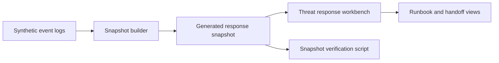

# Technical Review Pack

## System Boundary

This repository is a self-contained incident-response simulation. It uses deterministic sample events to model triage, detection tuning, handoff, and response queue behavior without requiring a live monitoring tenant or external data source.

## Architecture Notes



The generated snapshot is treated as a build artifact from source logs. That keeps the UI deterministic while still exercising the data-normalization path.

## Demo Path

```bash
npm ci
npm run prepare:sample
npm run verify
```

Useful entry points:

- `scripts/build_security_snapshot.py`
- `scripts/verify_snapshot.sh`
- `src/App.tsx`
- `src/data/generatedSnapshot.json`

## Validation Evidence

- Snapshot generation is scriptable and verified.
- Type checks, tests, build, and snapshot verification run through `npm run verify`.
- The project has no required credentials or live network dependency.

## Threat Model

| Risk | Control |
|---|---|
| Synthetic scenario drift | generated snapshot verification |
| Misleading response state | typed event and summary models |
| Hidden live dependency | no required external tenant or key |
| Secret leakage | repository secret scanning and public fixtures |

## Maintenance Notes

- Keep generated data reproducible from `samples/` or source fixtures.
- Add scenario tests before expanding response lanes.
- Keep runbook steps concrete and action-oriented.
- Avoid embedding private indicators or live tenant identifiers.
